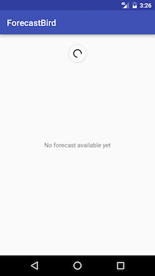
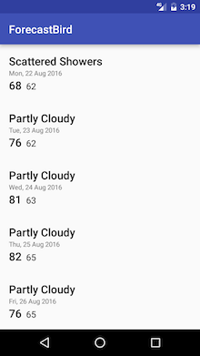

# forecast-bird

A sample app that shows weather forecast for Amsterdam

 
### Features
The app covers all the original requirements with an addition that it has a capability to cache the previously fetched forecast. That means, when we first open it, it will fetch a list of forecast if there is Internet connection. But the next time we open in a scenario of no Internet connection, the app will show the forecast list that it fetched in the first place instead of just showing an empty page.
### Project structure
There are two flavors: `mock` and `production`. The `mock` flavor was born to serve writing Espresso tests. So in order to see how the app works in reality, we have to switch Build Variants on Android Studio to `productionDebug`.

App package is structured by features.
  * `api`: Defines all the data models that represent forecast data returned by the Yahoo server. Thus, also defines some networking classes interacting with the server.
  * `data`: Defines a SQLite-based storage for all the data models defined the `api` package.
  * `forecast`: Represents the Forecast screen.
  * `util`: Some utility classes used in various parts of the project.
  * `binding`: Provides additional `BindingAdapter`s and `BindingConversion`s.

Note that the project requires JDK8 to get it compiled successfully because it takes advantage of [retrolambda](https://github.com/evant/gradle-retrolambda) to simplify some RxJava callbacks.
### Architecture overview
Development of the app was driven by MVVM architecture to maximize capability of producing testable code. That's basically done by pulling lots of business logic code into the ViewModel layer.

The data binding library was utilized to wire relationship between the ViewModel side and the View side. For instance, `ForecastViewModel` expose a `forecastItemViewModels` property. That property is bound to a `RecyclerView` via a binding expression `items="@{viewModel.forecastItemViewModels}"`. Right after `ForecastRepository` manages to fetch forecast, `ForecastLoader` is notified then and the loader will load data from database and update the `forecastItemViewModels` property accordingly. The `RecyclerView` will show that forecast list without us doing anything.

### Testing
Run `./gradlew clean test connectedAndroidTest --continue` to execute both unit and instrumentation tests. The instrumentation tests are located in the `androidTestMock` folder while the unit tests are inside the `test` folder.

### TODO
* Show more weather info rather than just forecast.
* Support multiple cities.
